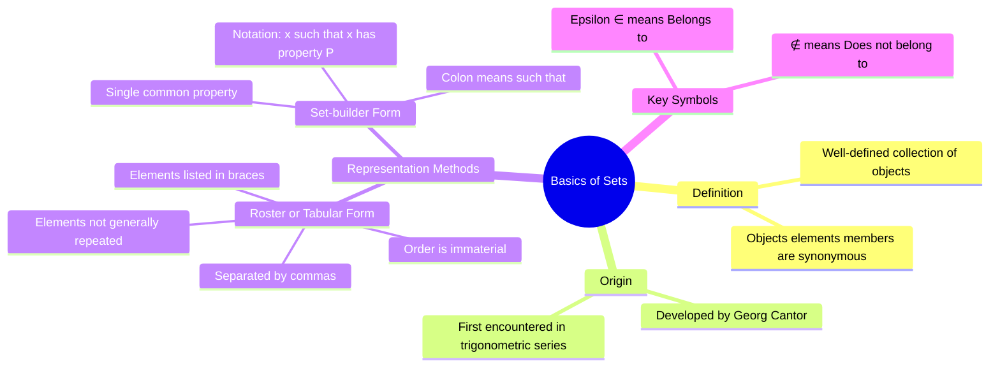
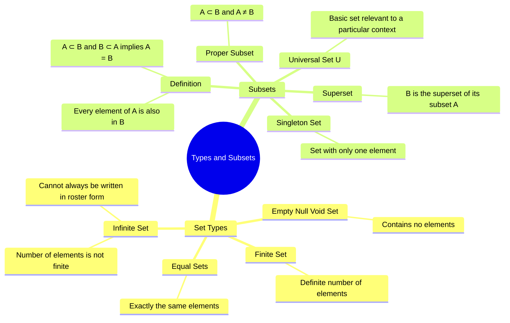
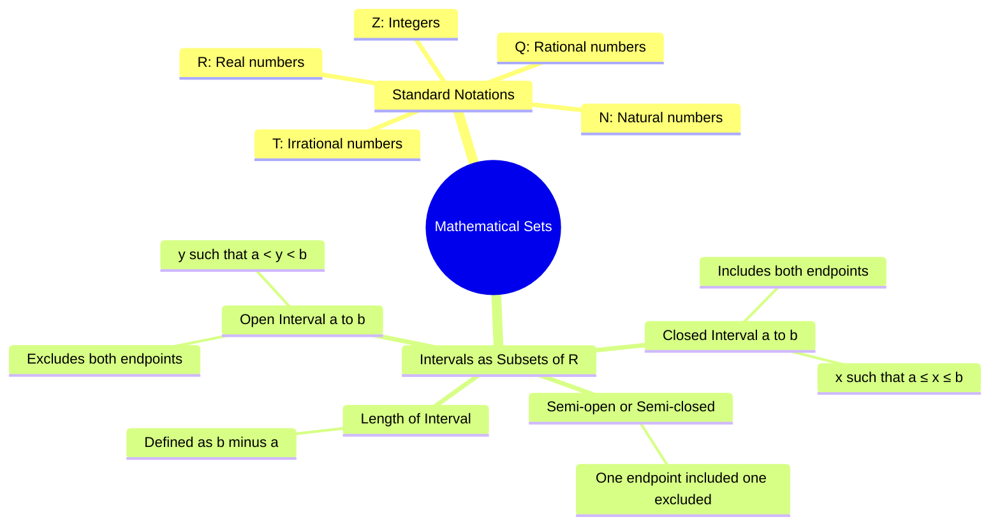
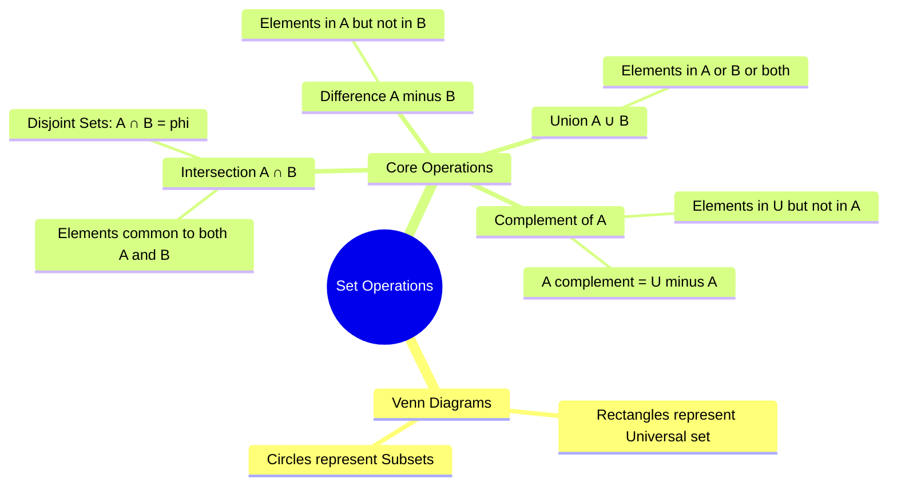
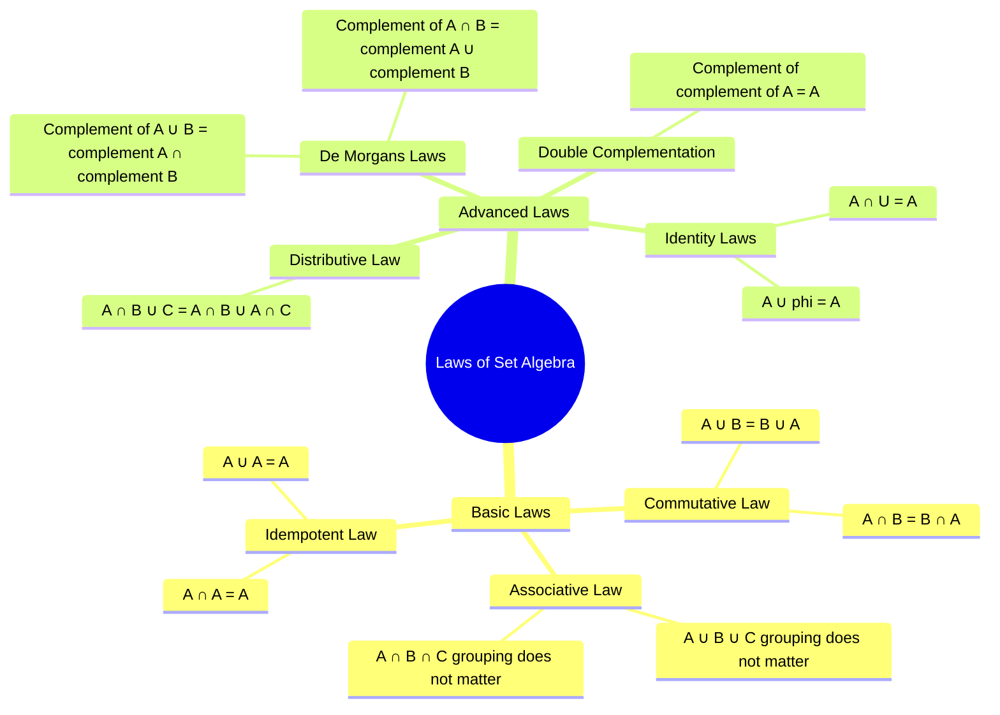

# Textual Mind Maps

### **Mindmap 1: Fundamentals of Sets**
*   **Definition:** A **well-defined collection** of objects [1, 2].
*   **Notation:**
    *   Elements denoted by small letters ($a, b, c...$) and sets by capital letters ($A, B, C...$) [3].
    *   **$\in$ (belongs to):** If $a$ is an element of set $A$ [3].
    *   **$\notin$ (does not belong to):** If $b$ is not an element of set $A$ [3].
*   **Representation Methods:**
    *   **Roster (Tabular) Form:** Elements listed in braces $\{ \}$, separated by commas; order is immaterial and elements are not generally repeated [4-6].
    *   **Set-builder Form:** Elements described by a **single common property** [6, 7].
*   **Standard Mathematical Sets:** $\mathbb{N}$ (Natural), $\mathbb{Z}$ (Integers), $\mathbb{Q}$ (Rational), $\mathbb{R}$ (Real), $\mathbb{T}$ (Irrational) [1, 8-10].

### **Mindmap 2: Types of Sets**
*   **Empty Set (Null/Void):** Contains **no elements**; denoted by $\phi$ or $\{ \}$ [2, 11].
*   **Finite Set:** Consists of a **definite number** of elements [2, 12].
*   **Infinite Set:** Number of elements is **not finite** (e.g., set of points on a line) [2, 12, 13].
*   **Equal Sets:** Two sets having **exactly the same elements** ($A = B$) [14, 15].
    *   Note: Repetition of elements does not change the set [16, 17].

### **Mindmap 3: Subsets and Intervals**
*   **Subsets ($A \subset B$):** Every element of $A$ is also an element of $B$ [15, 18].
    *   $A \subset B$ and $B \subset A \iff A = B$ [19].
    *   Every set is a subset of itself; $\phi$ is a subset of every set [19].
*   **Proper Subset & Superset:** If $A \subset B$ and $A \neq B$, $A$ is the **proper subset** and $B$ is the **superset** [20].
*   **Singleton Set:** A set with only **one element** [20].
*   **Intervals (Subsets of $\mathbb{R}$):**
    *   **Open $(a, b)$:** $\{x : a < x < b\}$; excludes endpoints [10, 21].
    *   **Closed $[a, b]$:** $\{x : a \leq x \leq b\}$; includes endpoints [21].
*   **Universal Set ($U$):** The basic set in a particular context from which all subsets are drawn [22].

### **Mindmap 4: Operations and Laws**
*   **Visual Tool: Venn Diagrams:** Rectangles represent the Universal set; circles represent subsets [23, 24].
*   **Core Operations:**
    *   **Union ($A \cup B$):** Elements in $A$ **or** $B$ (common elements taken once) [15, 25, 26].
    *   **Intersection ($A \cap B$):** Elements **common** to both $A$ and $B$ [15, 27].
        *   **Disjoint Sets:** If $A \cap B = \phi$ [28].
    *   **Difference ($A - B$):** Elements in $A$ but **not in $B$** [15, 29].
    *   **Complement ($A'$):** Elements in $U$ that are **not in $A$** ($U - A$) [15, 30, 31].
*   **Key Laws:**
    *   **De Morgan’s Laws:** $(A \cup B)' = A' \cap B'$ and $(A \cap B)' = A' \cup B'$ [31-33].
    *   **Commutative:** $A \cup B = B \cup A$; $A \cap B = B \cap A$ [28, 34].
    *   **Distributive:** $A \cap (B \cup C) = (A \cap B) \cup (A \cap C)$ [29].
    *   **Double Complement:** $(A')' = A$ [33, 35].

# Graphical Mind Maps

Based on the source material provided, here are the revision mindmaps for Chapter 1 on **Sets**, including **Mermaid syntax** for visual representation.

### **Mindmap 1: Basics and Representation**
This mindmap covers the core definition of a set, its origins, and the two primary methods used to represent them.

***

### **Mindmap 2: Types of Sets and Subsets**
This mindmap classifies the different categories of sets and explores the relationship between a set and its subsets.

***

### **Mindmap 3: Standard Sets and Intervals of R**
This mindmap details the standard mathematical notation for number sets and how real number subsets are represented as intervals.

***

### **Mindmap 4: Operations on Sets**
This mindmap covers the fundamental operations that can be performed on sets, which are often visualized using **Venn diagrams**.

***

### **Mindmap 5: Laws of Set Algebra**
This mindmap summarizes the mathematical laws governing set operations.

